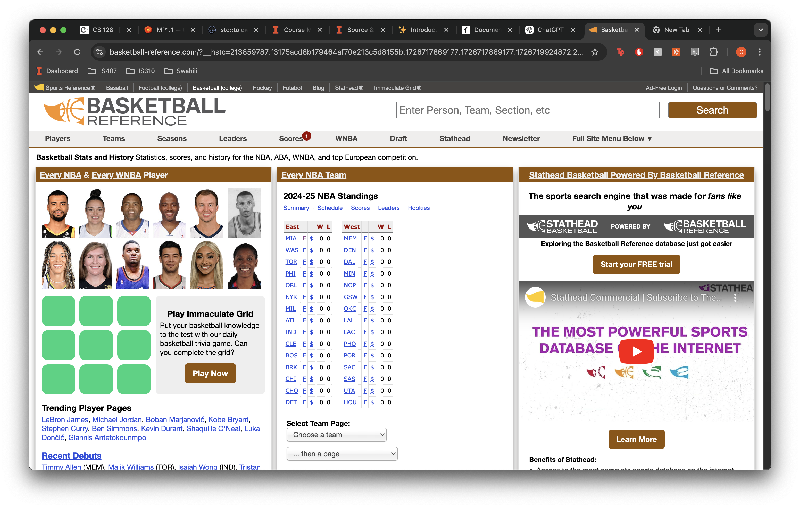
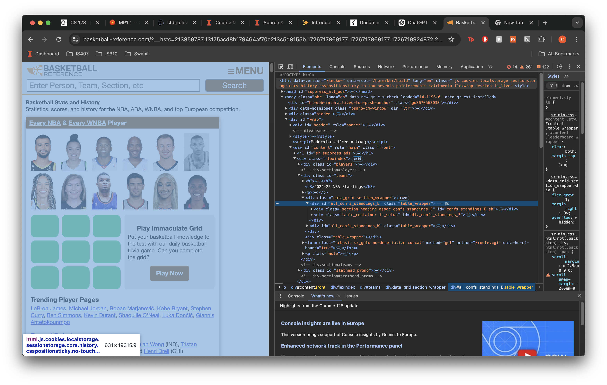
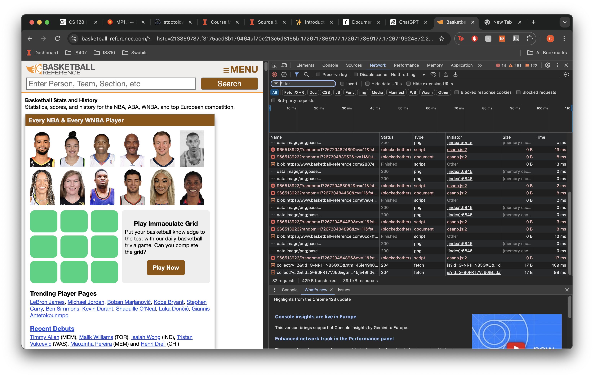

The website Basketball Reference was built by Sports Reference, LLC, which was founded by Sean Forman. Forman originally launched Baseball Reference in 2000, and the success of that site led to the creation of Basketball Reference in 2004. Sports Reference operates multiple popular sports statistics websites, and their goal has been to provide comprehensive and accessible sports data.

Using Inspect Element within Chrome, you can see that this website is built using html, css and javascript. 

The main structure od the website is HTML as you can see in the screenshot below :

Taking further look within the website, you can see elements such as scripts, giving me the clue that this was made with Javascript as well
since javascript supports html elements.

